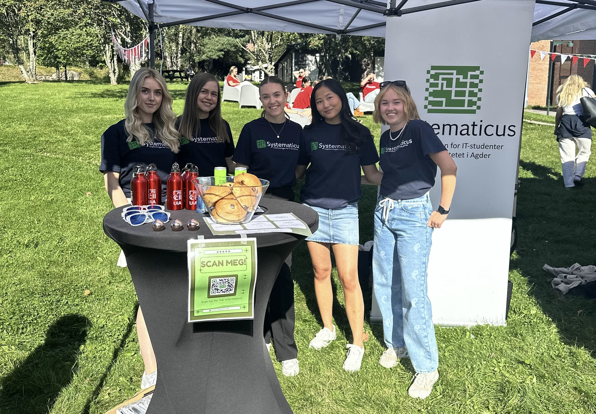

# 👨‍💻 GitCommitted – Gruppe 15

Velkommen til gruppe-CV for **GitCommitted** - Her er nettsiden vår for å bli kjent
med vår bachelor-gruppe. Vi gleder oss veldig til prosjektet!

---

## 🧑‍🤝‍🧑 Om Oss

Vi har jobbet sammen siden første semester og har opparbeidet oss bred kompetanse innen IT. Vi er opptatt av god struktur, kommunikasjon og å levere solide resultater – samtidig som vi har det gøy og lærer masse nytt!

---

## 👥 Medlemmer

| Navn                      | Rolle                        | Kontakt                    |
|---------------------------|------------------------------|----------------------------|
| Simen Emil Wiig Holmen    | Prosjektleder                | [GitHub](https://github.com/simholmen) / [LinkedIn](https://linkedin.com/in/simenholmen) / [Portofølje](https://portfolioreact-simholmens-projects.vercel.app) |
| Siri Johansen Thunestvedt | UX Designer & Akademisk skriving | [GitHub](https://github.com/sirijt) / [LinkedIn](https://www.linkedin.com/in/siri-johansen-thunestvedt-793446262/) |
| Lena Gjøse                | UX Designer                  | [GitHub](https://github.com/Lenagjose) / [LinkedIn](https://www.linkedin.com/in/lena-gjøse-060434380/) |
| Lars Kydland              | Frontend utvikler            | [GitHub](https://github.com/Larskyd) / [LinkedIn](https://www.linkedin.com/in/lars-kydland-aa930135a/) / [Portofølje](https://portofolie.vercel.app/) |
| Jens Haakaas              | Backend utvikler & AI-ekspert| [GitHub](https://github.com/jenshaak) / [LinkedIn](https://www.linkedin.com/in/jens-haakaas-a769b82b7/) / [Nettlio](https://www.nettlio.com) |
| Ingri Drabløs Bolstad     | Backend utvikler             | [GitHub](https://github.com/Ingribolstad) / [LinkedIn](https://www.linkedin.com/in/ingri-bolstad-04b8112b3/) |

---

## 🚀 Prosjekter

### Semesterprosjekt med Kartverket
Ny løsning for innmelding av endringer i kart.  
Teknologier: .NET, MariaDB  
Karakter: B

### Semesterprosjekt i GIS og AI
System for rutevalg i krisesituasjoner med AI-detektering av bygninger.  
Teknologier: React, Python, PostgreSQL, QGIS  
Karakter: A

---

## 🛠️ Kompetanse

- **Frontend:** HTML, CSS, JavaScript, React, PHP
- **Backend:** Python, Java, .NET
- **Database:** PostgreSQL, MariaDB, MySQL
- **Teknologier:** Docker, GitHub Actions, Figma, QGIS, Git, Wordpress, Shopify

---

## 📸 Aktiviteter

Noen høydepunkter fra våre aktiviteter:

---

## 📬 Kontakt Oss

- **E-post:** [seholmen@uia.no](mailto:seholmen@uia.no)
- **Telefon:** +47 475 40 288
- **LinkedIn:** [Simen Emil Wiig Holmen](https://linkedin.com/in/simenholmen)

---

> **Gruppe 15 – GitCommitted**  
> Universitetet i Agder, 2025
